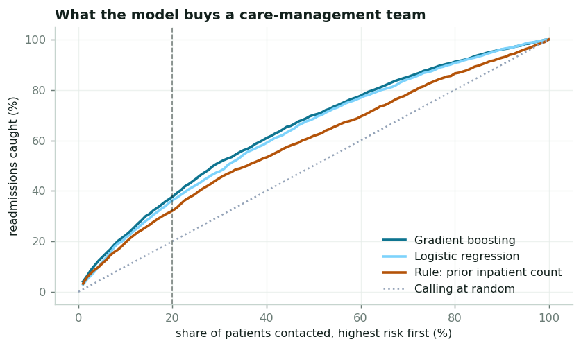
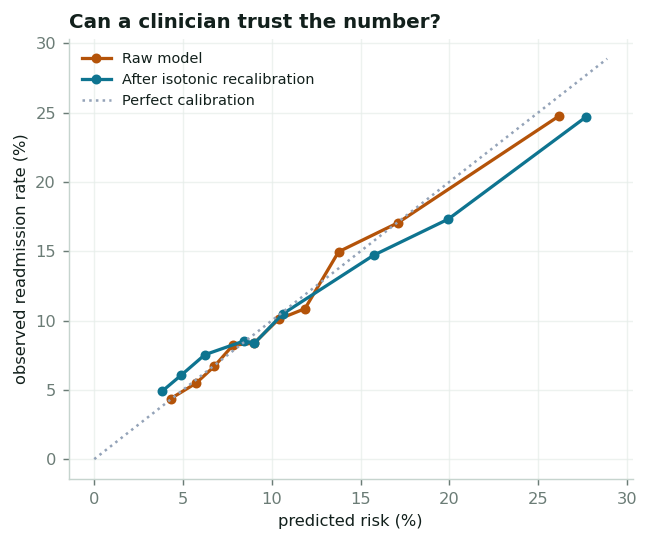
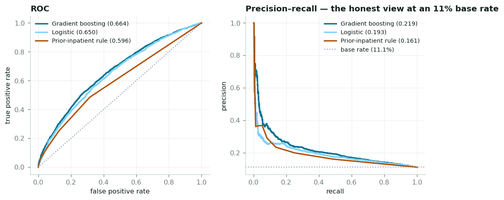

# 30-Day Readmission Risk — An Honest Evaluation

[](https://github.com/adapapavandharma/readmission-risk/actions/workflows/ci.yml) [](https://www.python.org/downloads/release/python-3120/) [](LICENSE)

**[→ Open the interactive evaluation](https://adapapavandharma.github.io/readmission-risk/)** — the lift table, three models against a rule baseline, calibration, and the two negative results. No install.

A 30-day hospital readmission model built on **99,343 real inpatient encounters** from the
UCI *Diabetes 130-US Hospitals* dataset (130 hospitals, 1999–2008), with a genuine
readmission label rather than a simulated one.

The model reaches **AUC 0.664**. That is a mediocre-sounding number, and the point of this
project is that AUC is the wrong thing to judge it on. What a care-management team needs to
know is: *if we work the top 20% of the list, what do we get?*

```
top 20% of discharges  →  37.7% of all readmissions caught
                          20.9% observed readmission rate in that tier (vs 11.1% overall)
                          1.89x enrichment,  number-needed-to-screen 4.8
```

---

## Findings

### 1. An 0.66 AUC model is still operationally useful

| List depth | Readmissions caught | Precision | Lift | NNS |
|---|---|---|---|---|
| Top 5% | 13.6% | 30.2% | 2.73× | 3.3 |
| Top 10% | 22.3% | 24.7% | 2.23× | 4.0 |
| Top 15% | 30.7% | 22.7% | 2.04× | 4.4 |
| **Top 20%** | **37.7%** | **20.9%** | **1.89×** | **4.8** |
| Top 30% | 51.2% | 18.9% | 1.71× | 5.3 |
| Top 50% | 70.1% | 15.5% | 1.40× | 6.4 |

<sub>Generated by `src/evaluate.py`; full table in [`outputs/lift_table.csv`](outputs/lift_table.csv).</sub>

Ranking is what a capacity-constrained team consumes, and the ranking is good even though
the discrimination is modest.

### 2. The model earns its complexity — but only just

| | ROC AUC | PR AUC | Recall @ top 20% |
|---|---|---|---|
| Gradient boosting | **0.664** | 0.219 | **37.7%** |
| Logistic regression | 0.650 | 0.193 | 36.3% |
| Rule: *count prior inpatient stays* | 0.596 | 0.161 | 32.2% |

A single variable a nurse can read off the chart gets **32.2%** of the way there. Gradient
boosting over 23 categorical and 16 numeric features buys **+5.5 percentage points** of
recall at the same list depth. That is a real gain worth having, and it is also a much
smaller gain than a bare AUC comparison suggests. Any deployment argument has to be made
against the rule, not against nothing.

### 3. `class_weight='balanced'` destroys calibration

The logistic model predicts a **mean risk of 46.3% against an observed rate of 11.1%** —
a calibration intercept of −2.07 and a Brier score of 0.227, against the gradient booster's
0.094. Its *ranking* is fine, which is why an AUC-only evaluation would never notice. But
you cannot put a number like that in front of a clinician, and any workflow with a fixed
probability threshold would fire on nearly everyone.

Class weighting buys sensitivity at the cost of the probability scale. If the deliverable
is a ranked list that is a fair trade; if it is a risk score, it is not.

### 4. Recalibrating an already-calibrated model makes it worse

The gradient booster came out calibrated on its own — slope 0.99, intercept −0.02, mean
predicted 11.3% against 11.1% observed. Fitting isotonic regression on top of it moved the
Brier score **0.0942 → 0.0945** and the slope **0.91 → 0.78**.

Recalibration is not free. It is a fitted model with its own variance, and applying it
reflexively costs accuracy. The project keeps the negative result rather than quietly
dropping the step.

### 5. Patient-level leakage is real in principle and negligible here

23.3% of patients appear in more than one encounter, so a random train/test split puts the
same person on both sides. Every split in this project is grouped on `patient_nbr` — and
the experiment that motivated it found the inflation is only **+0.002 AUC**:

| | Random split | Patient-grouped | Inflation |
|---|---|---|---|
| Logistic | 0.6658 | 0.6650 | +0.0008 |
| Gradient boosting | 0.6790 | 0.6767 | +0.0023 |

The grouped split is still the correct methodology and stays. But the honest conclusion is
that on *this* dataset the leakage everyone warns about does not move the number, because
the features describe clinical state rather than patient identity. Worth measuring instead
of asserting in either direction.







---

## The three traps in this dataset

Handled explicitly in [`src/build_dataset.py`](src/build_dataset.py):

1. **Some patients cannot be readmitted.** Discharge dispositions 11/19/20/21 are deaths and
   13/14 are hospice — 2,423 encounters that are guaranteed negatives for reasons unrelated
   to readmission risk. Left in, the model scores easy points by learning to detect dying
   patients. Removed, per Strack et al. (2014).

2. **The target has three levels.** `readmitted` is `<30`, `>30`, or `NO`. Only `<30` is the
   CMS-penalised event. `>30` is folded into the negative class rather than dropped —
   discarding it would remove the hardest negatives and inflate apparent performance.

3. **Encounters are not independent.** 99,343 encounters, 69,990 patients. See finding 5.

---

## Deliverable: a tiered risk board

A probability column is not something a team can use. [`src/registry.py`](src/registry.py)
derives tier boundaries from actual outreach capacity — 120 discharges/day, 24 contacts/day
— rather than from round numbers, and back-tests the board:

| Tier | Share of list | Predicted risk | **Observed** | Share of all readmissions |
|---|---|---|---|---|
| High — call before discharge | 20% | 21.6% | **20.9%** | 37.7% |
| Medium — post-discharge follow-up | 30% | 12.0% | **12.0%** | 32.4% |
| Low — standard discharge | 50% | 6.7% | **6.6%** | 29.9% |

Predicted and observed agree to within a percentage point in every tier, which is the
practical statement of finding 4.

**This is enrichment, not prevention.** The model identifies who is likely to come back.
Whether calling them changes that is a question only a trial can answer, and nothing here
should be read as evidence that it does.

---

## Stack

**Python** — pandas, scikit-learn (`HistGradientBoostingClassifier`, `StratifiedGroupKFold`,
isotonic calibration), NumPy, SciPy, Matplotlib · **SQL** — SQLite risk registry with window
functions · Parquet interchange.

## Reproducing

```bash
pip install -r requirements.txt
python run.py
```

Or step by step:

```bash
python src/download.py        # UCI dataset (~3 MB), not committed
python src/build_dataset.py   # clean, handle the three traps
python src/model.py           # leakage experiment, grouped CV, hold-out fit
python src/evaluate.py        # lift, calibration, decision curve, figures
python src/registry.py        # tiered risk board -> SQLite
```

Deterministic given `SEED = 20260803`.

## Tests

```bash
pip install -r requirements-dev.txt
pytest tests/ -q
```

The suite is hermetic — it builds every fixture in code and never touches
`data/external/`, `data/interim/` or the network, so it runs on a clean checkout
and in CI. It covers the ICD-9 grouping against an independently transcribed
Strack table, the cleaning rules for all three traps, the lift/NNS table, the
calibration slope and intercept, the decision curve, the leakage experiment and
the SQL risk board. A handful of tests are marked `xfail` with a written reason:
those are known defects, kept visible rather than deleted.

## Data source

Strack B, DeShazo JP, Gennings C, et al. *Impact of HbA1c Measurement on Hospital
Readmission Rates: Analysis of 70,000 Clinical Database Patient Records.* BioMed Research
International, 2014. Distributed via the UCI Machine Learning Repository
([dataset 296](https://archive.ics.uci.edu/dataset/296/diabetes+130+us+hospitals+for+years+1999+2008)),
CC BY 4.0. The raw file is fetched by `src/download.py`, not committed.
